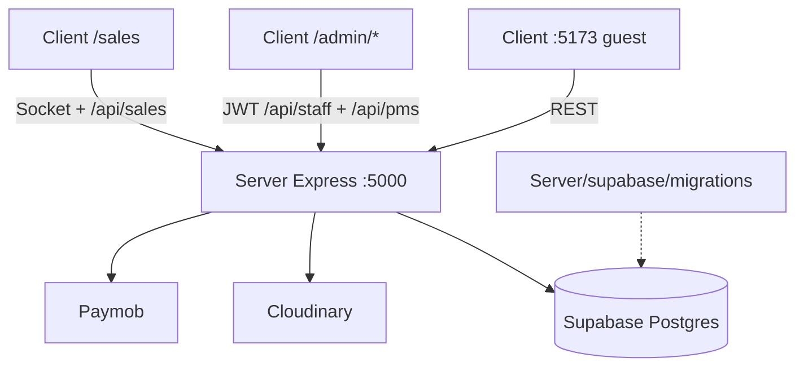

# Main Soul — Workspace Architectural Map

> **Updated:** 2026-07-15 (unified Client)  
> **Workspace root:** `Main Soul/`

---

## Layout

```
Main Soul/
├── Client/                      # Single Vite SPA
│   └── src/
│       ├── …                    # Guest + sales
│       └── admin/               # PMS UI modules (routes under /admin/*)
├── Server/                      # Backend + DB
│   ├── src/                     # Express API — :5000
│   └── supabase/migrations/     # Postgres schema
├── package.json
├── .env.example                 # Copy to Server/.env
├── README.md
└── WORKSPACE_MAP.md
```



---

## Server

| Item | Path |
|------|------|
| Entry | `Server/src/server.js` |
| App | `Server/src/app.js` |
| DB pool + auto-migrate | `Server/src/config/db.js` → `Server/supabase/migrations/` |
| Paymob | `Server/src/config/paymob.js` |
| Cloudinary | `Server/src/config/cloudinary.js` |
| PMS routes | `Server/src/routes/pms/` |
| Env | `Server/.env` (from root `.env.example`) |

### Migrations

1. `001_guest_schema.sql`
2. `002_pms_ops.sql`
3. `003_links_and_unit_ops_columns.sql`
4. `004_guest_local_auth.sql`

---

## Client

| Surface | Path | URL |
|---------|------|-----|
| Guest website | `Client/src/` | http://localhost:5173 |
| PMS admin | `Client/src/admin/` | http://localhost:5173/admin (login via `/sign-in`) |
| Sales | `Client/src/pages/sales/` | http://localhost:5173/sales |

Admin Axios rewrites `/auth/*` → `/api/staff/auth/*` and other calls → `/api/pms/*`.

---

## Scripts (root `package.json`)

```bash
npm run install:all
npm run dev:server
npm run dev:client
npm start                 # production Server
```
